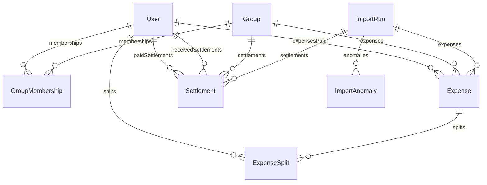

# Scope Document: Anomaly Detection & Database Schema

This document outlines the detailed specifications of the 19 CSV data anomalies detected by the import pipeline, their resolution policies, and the database schema definition with field rationales.

---

## 1. CSV Anomaly Log & Detection Matrix

The following table documents each of the 19 CSV data anomalies, how the codebase detects them, default recovery policies, and available user overrides.

| # | Anomaly Type | Row(s) | Exact CSV Row Data | Detection Method | Default Policy | User Overrides |
|---|--------------|--------|---------------------|------------------|----------------|----------------|
| **1** | **DUPLICATE** | 6 | `08-02-2026,dinner - marina bites,Dev,3200,INR,equal,Aisha;Rohan;Priya;Dev,,` | Checks if a row shares the same date (normalized), payer (normalized), and amount (excluding commas/precision) as a previous row. | Mark the latter row as `SKIP` by default to avoid double counting. | User can choose to `ACCEPT` (import it anyway) or keep it `SKIPPED`. |
| **2** | **MALFORMED_AMOUNT** | 7 | `10-02-2026,Electricity Feb,Aisha,"1,200",INR,equal,Aisha;Rohan;Priya;Meera,,` | Checks if the amount string contains thousands separators (commas). | Strips commas and parses as a numeric float (e.g. 1200). `WARNING` severity. | User can manually modify the amount if the parsed value is incorrect. |
| **3** | **SETTLEMENT_AS_EXPENSE** | 14 | `25-02-2026,Rohan paid Aisha back,Rohan,5000,INR,,Aisha,,this is a settlement not an expense??` | Triggered when `split_type` is empty and the description contains payment-related keywords (e.g. "paid", "settled", "paid back"). `ERROR` severity. | Flag as a payment settlement (from Payer to Payee) instead of a shared group expense. | User can confirm to import it as a Settlement, switch to an Expense, or skip the row. |
| **4** | **PERCENTAGE_SUM** | 15 | `28-02-2026,Pizza Friday,Aisha,1440,INR,percentage,Aisha;Rohan;Priya;Meera,Aisha 30%; Rohan 30%; Priya 30%; Meera 20%,percentages might be off` | Checks if the sum of specified percentages in `split_details` does not equal 100% (within 0.02 tolerance). `ERROR` severity. | Proportional normalization: normalizes shares dynamically to sum to 100% (Aisha 27.27%, Rohan 27.27%, Priya 27.27%, Meera 18.18%). | User can override the details, accept the normalized split, or edit percentages manually. |
| **5** | **MISSING_PAYER** | 13 | `22-02-2026,House cleaning supplies,,780,INR,equal,Aisha;Rohan;Priya;Meera,,can't remember who paid` | Triggered when the `paid_by` field is blank or doesn't map to any database user. `ERROR` severity. | Block execution. Payer must be defined. | User must select a valid member as the payer from the UI dropdown or choose to skip the row. |
| **6** | **FOREIGN_CURRENCY** | 20, 21, 23, 26 | *Multiple USD Rows* | Checks if the currency field is equal to `USD` (or any non-INR currency). `WARNING` severity. | Fetches the historical rate on the expense date from a public API. Converted amount stored in INR. | User can input a custom exchange rate manually or accept the retrieved rate. |
| **7** | **NONMEMBER_IN_SPLIT** | 23 | `11-03-2026,Parasailing,Dev,150,USD,equal,Aisha;Rohan;Priya;Dev;Dev's friend Kabir,,Kabir joined for the day` | Checks if any member listed in the `split_with` column is not in the database of users. `ERROR` severity. | Dynamically create a guest user (e.g. "Dev's friend Kabir") and add them to the group membership. | User can choose to add them as a guest, redistribute their share to other members, or skip the row. |
| **8** | **NEGATIVE_AMOUNT** | 26 | `12-03-2026,Parasailing refund,Dev,-30,USD,equal,Aisha;Rohan;Priya;Dev,,one slot got cancelled` | Checks if the parsed numeric amount is less than 0. `WARNING` severity. | Treat as a credit/refund: reduces participants' balances rather than charging them. | User can adjust the amount, accept the negative amount, or skip it. |
| **9** | **AMBIGUOUS_DATE** | 27 | `Mar-14,Airport cab,rohan ,1100,INR,equal,Aisha;Rohan;Priya;Dev,,` | Checks if the date string fails standard DD-MM-YYYY formats but is parseable via custom rules. `WARNING` severity. | Parses "Mar-14" as March 14, 2026. Defaults to March 14, 2026 if parsing fails. | User can pick an alternative date via a datepicker. |
| **10** | **MISSING_CURRENCY** | 28 | `15-03-2026,Groceries DMart,Priya,2105,,equal,Aisha;Rohan;Priya;Meera,,forgot to set currency` | Checks if the currency field is blank. `ERROR` severity. | Assume the group's default currency (INR). | User can choose to accept the default (INR), change the currency, or skip the row. |
| **11** | **ZERO_AMOUNT** | 31 | `22-03-2026,Dinner order Swiggy,Priya,0,INR,equal,Aisha;Rohan;Priya;Meera,,counted twice earlier - fixing later` | Checks if the parsed amount is exactly 0. `ERROR` severity. | Skipped automatically since zero-amount expenses have no financial impact. | User can choose to skip or manually set a non-zero amount. |
| **12** | **AMBIGUOUS_DATE_FORMAT** | 34 | `04-05-2026,Deep cleaning service,Rohan,2500,INR,equal,Aisha;Rohan;Priya,,is this April 5 or May 4? format is a mess` | Checks if notes explicitly raise confusion regarding DD/MM vs MM/DD formats. `ERROR` severity. | Surface interpretation options. Default to May 4, 2026. | User must select either May 4, 2026 or April 5, 2026. |
| **13** | **DUPLICATE_DIFFERENT_AMOUNT** | 24, 25 | `11-03-2026,Dinner at Thalassa,Aisha,2400...` vs `11-03-2026,Thalassa dinner,Rohan,2450...` | Looks for matching dates, similar descriptions, and matching participants but with different amounts/payers. `ERROR` severity. | Flag both rows. Suggest keeping Rohan's (based on note indicating Aisha's is wrong). | User decides which row to keep and which to skip. |
| **14** | **MEMBER_AFTER_DEPARTURE** | 36 | `02-04-2026,Groceries BigBasket,Priya,2640,INR,equal,Aisha;Rohan;Priya;Meera,,oops Meera still in the group list` | Checks if a split participant has left the group prior to the expense date (based on `leftAt` field). `ERROR` severity. | Remove the departed member (Meera) from the split and redistribute her share. | User can confirm removal, override the date, or choose to skip the row. |
| **15** | **DEPOSIT_AS_EXPENSE** | 38 | `08-04-2026,Sam deposit share,Sam,15000,INR,equal,Aisha,,Sam moving in! paid Aisha his deposit` | Checks if the description represents a deposit or transfer to a single member. `ERROR` severity. | Route as a Settlement (Sam → Aisha) instead of a shared group expense. | User can confirm to import as a Settlement, proceed as an Expense, or skip the row. |
| **16** | **SPLIT_TYPE_MISMATCH** | 42 | `18-04-2026,Furniture for common room,Aisha,12000,INR,equal,Aisha;Rohan;Priya;Sam,Aisha 1; Rohan 1; Priya 1; Sam 1,split_type says equal but someone added shares anyway` | Checks if split type is `EQUAL` but `split_details` provides specific ratios/shares. `WARNING` severity. | Prefer the specific ratios outlined in `split_details` (shares). | User can force an equal split or manually specify percentages/amounts. |
| **17** | **UNKNOWN_PAYER_NAME** | 11 | `18-02-2026,Groceries DMart,Priya S,1875,INR,equal,Aisha;Rohan;Priya;Meera,,` | Payer field does not match any exact member but is close via Levenshtein distance. `WARNING` severity. | Match to "Priya" (Levenshtein distance 2). | User can confirm matching, assign to a different user, or skip. |
| **18** | **PAYER_NAME_CASE** | 9 | `14-02-2026,Movie night snacks,priya,640,INR,equal,Aisha;Rohan;Priya,,Meera skipped` | Checks if payer name differs only in casing or trailing spaces. `INFO` severity. | Normalise to title-case ("Priya") and strip trailing spaces. | System automatically handles normalisation without blocking import. |
| **19** | **EXCESSIVE_PRECISION** | 10 | `15-02-2026,Cylinder refill,Rohan,899.995,INR,equal,Aisha;Rohan;Priya;Meera,,` | Checks if the amount string has more than 2 decimal places. `INFO` severity. | Rounds amount to the nearest paisa/cent (₹900.00). | User can override with a manually entered value if desired. |

---

## 2. Database Schema & Rationales

The database uses PostgreSQL managed via Prisma. Here is the layout of the tables and the logic behind their design.

### 2.1 Schema Overview Diagram

### 2.2 Table Definitions & Field Rationales

#### **User**
Stores the core authentication and profile details for members.
- `id` (Int, PK): Autoincrementing unique identifier.
- `email` (String, Unique): User email, used for login credentials.
- `name` (String): Display name of the member.
- `passwordHash` (String): BCrypt hash of the user password.
- `createdAt` (DateTime): Timestamp when the user registered.

#### **Group**
Represents a flat/house sharing shared ledger.
- `id` (Int, PK): Autoincrementing unique identifier.
- `name` (String): Name of the group (e.g. "Flat 4B").
- `description` (String, Optional): Quick summary of what the group splits.
- `currency` (String): Standard default group currency (INR).

#### **GroupMembership**
Represents the membership mapping. This table has join/leave dates to handle changes over time.
- `id` (Int, PK): Unique identifier.
- `groupId` (Int, FK): Links to Group.
- `userId` (Int, FK): Links to User.
- `joinedAt` (DateTime): The date the user joined the flat.
- `leftAt` (DateTime, Nullable): The date the user left the flat. If `NULL`, the user is currently active.
- *Rationale*: A simple flat membership list is insufficient. Having `joinedAt` and `leftAt` is critical so that latecomers (e.g. Sam) aren't charged for past expenses (e.g. February rent), and departed flatmates (e.g. Meera) aren't split into expenses created after they left.

#### **Expense**
Represents a ledger charge paid by a member.
- `id` (Int, PK): Unique identifier.
- `groupId` (Int, FK): Links to Group.
- `description` (String): Summary of the expense.
- `amount` (Decimal): Original amount entered in its local currency. Uses 4 decimal places to handle high-precision edge cases (like Row 10).
- `currency` (String): Original currency code (e.g. USD, INR).
- `amountInr` (Decimal): The amount converted to INR. All group balance equations use `amountInr` directly.
- `exchangeRate` (Decimal, Nullable): Exchange rate applied during conversion.
- `paidById` (Int, FK): Links to User (Payer).
- `splitType` (Enum: EQUAL, PERCENTAGE, SHARE, UNEQUAL): Determines calculation logic.
- `date` (DateTime): The actual transaction date.
- `isDeleted` (Boolean): Soft-delete flag.
- `importRunId` (Int, FK, Nullable): Links to the import run that generated this record.

#### **ExpenseSplit**
Splits an expense among participants.
- `id` (Int, PK): Unique identifier.
- `expenseId` (Int, FK): Links to Expense.
- `userId` (Int, FK): Links to User.
- `share` (Decimal): Raw share value (either percentage, share count, or exact unequal amount).
- `amountOwed` (Decimal): Computed final portion in INR that this specific user owes.

#### **Settlement**
Tracks payments made between users to settle net debts.
- `id` (Int, PK): Unique identifier.
- `groupId` (Int, FK): Links to Group.
- `payerId` (Int, FK): The debtor who is paying.
- `payeeId` (Int, FK): The creditor receiving the funds.
- `amount` (Decimal): Converted amount in INR.
- `currency` (String): Currency of settlement (defaults to INR).
- `date` (DateTime): Transaction date.
- `importRunId` (Int, FK, Nullable): Links to the import run.

#### **ImportRun & ImportAnomaly**
Orchestrates the two-phase import wizard, storing rows and pending resolution choices.
- *ImportRun* holds metadata of the import file (row counts, status: `PENDING`, `REVIEW`, `COMPLETE`, `FAILED`).
- *ImportAnomaly* holds row-by-row scans:
  - `rowRaw`: Raw row text JSON.
  - `anomalyType`: The flagged anomaly.
  - `resolution` (Enum: `PENDING`, `ACCEPTED`, `MODIFIED`, `SKIPPED`).
  - `resolvedData`: JSON string containing user overrides (e.g. manually selected payer, split type overrides, manual exchange rate, etc.).
